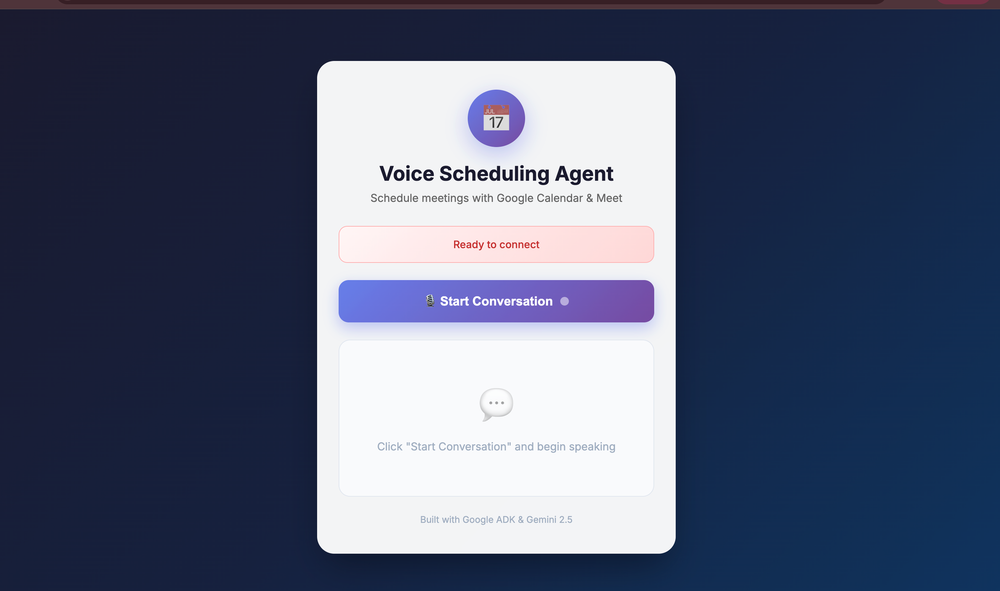
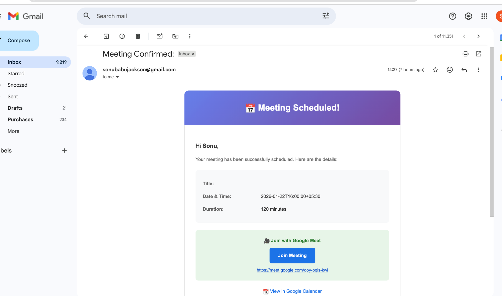
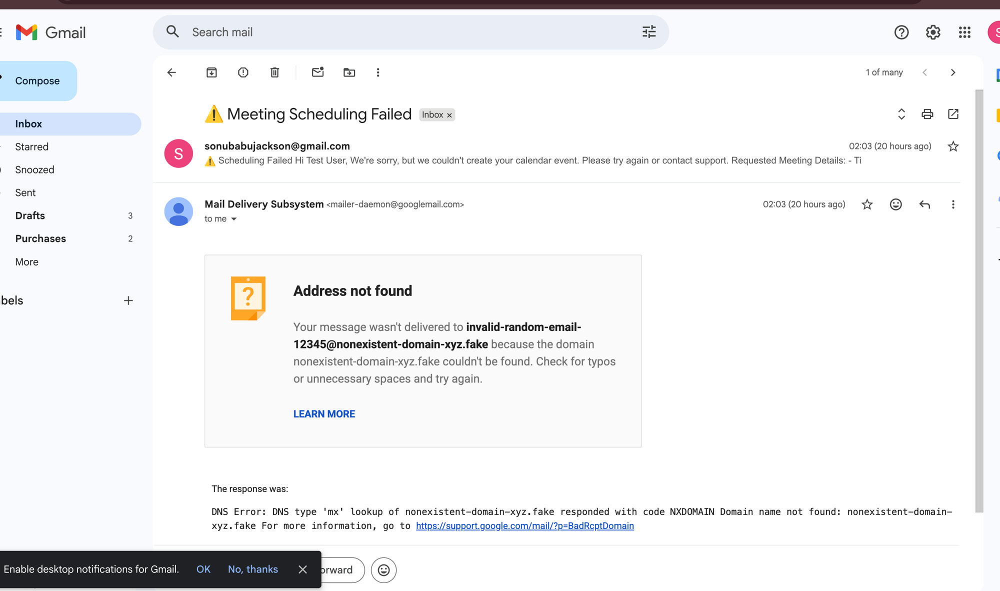

# Voice Scheduling Agent

A real-time voice-powered AI assistant that schedules meetings using Google Calendar, built with **Google ADK (Agent Development Kit)**, **Gemini 2.5 Flash Native Audio**, and integrated with **n8n** for calendar automation.

---

## Live Demo

**Deployed URL:** [https://testingvoice.duckdns.org/](https://testingvoice.duckdns.org/)

---

## How to Test the Agent

### Step 1: Access the Application

Open your browser and navigate to:
```
https://testingvoice.duckdns.org/
```

You'll see the Voice Scheduling Agent interface:



### Step 2: Start a Conversation

1. Click the **"Start Conversation"** button
2. Allow microphone access when prompted by your browser
3. Wait for the status to change to "Connected"

### Step 3: Schedule a Meeting

Speak naturally to schedule a meeting. The AI assistant (Ava) will guide you through collecting:

1. **Event purpose** - What's the meeting about? (becomes the title)
2. **Your name** - Who is scheduling the meeting?
3. **Your email** - Where to send the confirmation
4. **Date** - When should the meeting be? (e.g., "tomorrow", "next Monday", "January 15th")
5. **Time** - What time? (e.g., "2pm", "14:00", "3 o'clock")
6. **Duration** - How long? (default: 30 minutes)

### Step 4: Confirm and Create

The AI will confirm all details before creating the event:
> "So that's [title] for [name], invite to [email], on [date] at [time] for [duration] minutes. Correct?"

Say "Yes" or "Correct" to create the meeting.

### Step 5: Receive Confirmation

Upon successful creation, you'll receive:
- A **confirmation email** with meeting details
- A **Google Meet link** for video conferencing
- A **Calendar link** to view the event



### Example Conversation

```
You: "I'd like to schedule a meeting"
Ava: "Hi! What kind of event would you like to schedule today?"

You: "A project discussion"
Ava: "Great! What's your name?"

You: "John Smith"
Ava: "And your email address?"

You: "john@example.com"
Ava: "What date works for you?"

You: "Tomorrow"
Ava: "And what time?"

You: "2pm"
Ava: "How long should the meeting be? The default is 30 minutes."

You: "One hour"
Ava: "So that's Project Discussion for John Smith, invite to john@example.com,
      on January 6th at 2:00 PM for 60 minutes. Correct?"

You: "Yes"
Ava: "Done! I've scheduled your meeting and sent a confirmation to john@example.com.
      Need anything else?"
```

---

## Calendar Integration Explained

### Architecture Overview

```
┌─────────────────┐     WebSocket      ┌─────────────────┐     Google ADK     ┌─────────────────┐
│   Web Browser   │◄──────────────────►│  Python Server  │◄──────────────────►│  Gemini 2.5     │
│   (Voice UI)    │    Audio Stream    │  (FastAPI)      │    Live Audio      │  Flash Audio    │
└─────────────────┘                    └────────┬────────┘                    └─────────────────┘
                                                │
                                                │ HTTP POST (Tool Call)
                                                ▼
                                       ┌─────────────────┐
                                       │  n8n Workflow   │
                                       │  ┌───────────┐  │
                                       │  │ Webhook   │  │
                                       │  └─────┬─────┘  │
                                       │        │        │
                                       │        ▼        │
                                       │  ┌───────────┐  │
                                       │  │ Google    │  │
                                       │  │ Calendar  │  │
                                       │  └─────┬─────┘  │
                                       │        │        │
                                       │        ▼        │
                                       │  ┌───────────┐  │
                                       │  │  Gmail    │  │
                                       │  │  (Email)  │  │
                                       │  └───────────┘  │
                                       └─────────────────┘
```

### How It Works

#### 1. Voice Input Processing
- User speaks into the microphone
- Audio is streamed via WebSocket to the server
- Server forwards audio to **Gemini 2.5 Flash Native Audio** via Google ADK
- Gemini processes speech and generates responses in real-time

#### 2. Tool Execution (Function Calling)
When the user confirms meeting details, Gemini calls the `schedule_meeting_sync` function:

```python
def schedule_meeting_sync(
    name: str,           # Attendee name
    email: str,          # Attendee email
    date: str,           # Date in YYYY-MM-DD format
    meeting_time: str,   # Time in HH:MM format (24-hour)
    title: str,          # Meeting title
    duration: int = 30   # Duration in minutes
) -> dict:
```

#### 3. n8n Workflow Integration

The function sends a webhook request to n8n with the meeting data:

```json
{
  "name": "John Smith",
  "attendee_email": "john@example.com",
  "title": "Project Discussion",
  "start_datetime": "2025-01-15T14:00:00",
  "end_datetime": "2025-01-15T15:00:00",
  "duration": 60
}
```

#### 4. n8n Workflow Steps

The n8n workflow (`n8n-workflows/voice-scheduling-workflow.json`) performs:

| Step | Node | Action |
|------|------|--------|
| 1 | **Webhook** | Receives meeting request from voice agent |
| 2 | **Google Calendar** | Creates calendar event with Google Meet link |
| 3 | **Check If Created** | Validates event was created successfully |
| 4 | **Gmail** | Sends confirmation or failure email |
| 5 | **Respond** | Returns result to voice agent |

#### 5. Email Notifications

**Success Email:**
- Meeting title, date, time, duration
- Google Meet video link
- Calendar link to view/edit event


**Failure Email:**
- Error notification
- Requested meeting details
- Instructions to retry



---

## Running Locally

### Prerequisites

- Python 3.12+
- Google Cloud API Key with Gemini access
- n8n instance (cloud or self-hosted)

### Installation

```bash
# Clone the repository
git clone <repository-url>
cd livekit-app

# Create virtual environment
python -m venv venv
source venv/bin/activate  # On Windows: venv\Scripts\activate

# Install dependencies
pip install -r requirements.txt

# Configure environment variables
cp server/.env.example server/.env
```

### Configuration

Edit `server/.env`:

```env
# Required: Google Gemini API Key
GOOGLE_API_KEY=your_google_api_key_here

# Required: n8n Webhook URL
N8N_WEBHOOK_URL=https://your-n8n-instance.app.n8n.cloud/webhook/schedule-meeting

# Server Configuration
WEBSOCKET_PORT=8003
MEDIA_STREAMS_PORT=8004

# Voice Settings
VOICE_NAME=Aoede
```

### Setting Up n8n Workflow

1. Log into your n8n instance
2. Create a new workflow
3. Import `n8n-workflows/voice-scheduling-workflow.json`
4. Configure credentials:
   - **Google Calendar**: Connect your Google account
   - **Gmail**: Connect your Google account (same or different)
5. Activate the workflow
6. Copy the webhook URL and update your `.env` file

### Start the Server

```bash
cd server
python main.py
```

The server starts:
- **Web UI**: http://localhost:8004
- **WebSocket**: ws://localhost:8003

---

## Project Structure

```
livekit-app/
├── server/
│   ├── main.py                       # Entry point
│   ├── core/
│   │   ├── adk_agent.py              # Gemini ADK agent with tools
│   │   ├── adk_websocket_handler.py  # WebSocket handler
│   │   ├── twilio_webhook.py         # FastAPI endpoints
│   │   └── ...
│   ├── config/
│   │   └── gemini_config.py          # Voice & VAD configuration
│   └── static/
│       └── index.html                # Voice chat UI
├── n8n-workflows/
│   └── voice-scheduling-workflow.json
├── docs/
│   └── images/                       # Screenshots
├── requirements.txt
└── README.md
```

---

## Features

- **Real-time Voice Conversations**: Bidirectional audio streaming with sub-second latency
- **Natural Language Understanding**: Understands dates like "tomorrow", "next Monday"
- **Google Calendar Integration**: Creates events with Google Meet links
- **Email Confirmations**: Beautiful HTML emails with meeting details
- **Error Handling**: Graceful failure notifications
- **Voice Activity Detection (VAD)**: Smart detection of speech start/end

---

## Tech Stack

| Component | Technology |
|-----------|------------|
| AI Model | Gemini 2.5 Flash Native Audio |
| Agent Framework | Google ADK (Agent Development Kit) |
| Backend | Python, FastAPI, WebSockets |
| Automation | n8n |
| Calendar | Google Calendar API |
| Email | Gmail API |
| Frontend | HTML, JavaScript, Web Audio API |

---

## Screenshots

### Voice Agent Web Interface

*The main interface where users interact with the voice agent*

### Successful Meeting Confirmation

*Email sent when a meeting is successfully scheduled with Google Meet link*

### Error Handling

*Email sent when scheduling fails, with error details*

---

## API Endpoints

| Endpoint | Method | Description |
|----------|--------|-------------|
| `/` | GET | Voice chat web UI |
| `/ws` | WebSocket | Voice streaming endpoint |
| `/health` | GET | Health check |
| `/twilio/incoming` | POST | Twilio incoming call webhook |
| `/twilio/media-stream` | WebSocket | Twilio Media Streams |

---

## Troubleshooting

### "Microphone access denied"
- Ensure your browser has microphone permissions enabled
- Check that the site is using HTTPS (required for microphone access)

### "Connection failed"
- Verify the server is running
- Check browser console for WebSocket errors
- Ensure firewall allows WebSocket connections

### "Meeting not created"
- Verify n8n workflow is active
- Check n8n execution logs for errors
- Ensure Google Calendar/Gmail credentials are valid

---

## License

Apache License 2.0

---

## Acknowledgments

- [Google ADK](https://github.com/google/adk) - Agent Development Kit
- [Gemini API](https://ai.google.dev/) - Google's multimodal AI
- [n8n](https://n8n.io/) - Workflow automation platform
